# 🍔 SavoryHub — Modern Food Ordering Frontend

> A premium **responsive food ordering frontend website** built using **HTML, CSS, and JavaScript**, featuring realistic menu sections, category-based browsing, customer reviews, and smooth interactive UI effects for a modern restaurant-style experience.

> A responsive **frontend food ordering website** built using **HTML, CSS, and JavaScript**, focused on modern UI design, smooth user interaction, and mobile-friendly layout.

---

## 📚 Project Journey

* 🎓 Originally created during my **1st year of college** while learning frontend development fundamentals.
* 🔄 Migrated from a **previous GitHub account/repository setup**.
* ✨ Added README documentation.

---

## 🏷 Project Type

**Frontend Web Application**
**Domain:** Food Ordering / Restaurant UI
**Tech Stack:** HTML, CSS, JavaScript

---

## ✨ Features

* 🍽 Hero section with premium restaurant branding
* ⭐ Chef’s Signature Picks with realistic dish descriptions
* 🖼 Featured Food Gallery aligned to actual food visuals
* 📂 Browse by Category with realistic Indian price ranges
* 💬 Customer review/testimonial cards
* 📱 Fully responsive mobile-first layout
* 🧭 Smooth scrolling navigation and section transitions
* 🎨 Hover overlays and polished food-card interactions
* ⚡ Lightweight pure JavaScript UI interactions

---

## 📸 Screenshots & Demo

> All demo videos and screenshots are organized inside the **`demo/`** folder.

## 🎥 Demo Walkthroughs

* 🎬 [Desktop Demo](./demo/SavoryHubDesktopViewDemo.mp4)
* 🎬 [Mobile Demo](./demo/SavoryHubMobileViewDemo.mp4)

### 🖥 Desktop Screens
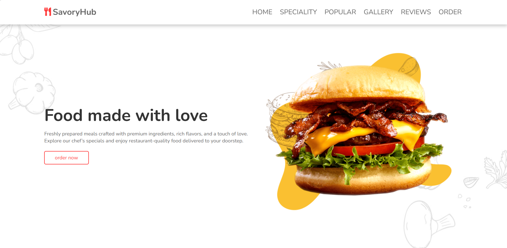
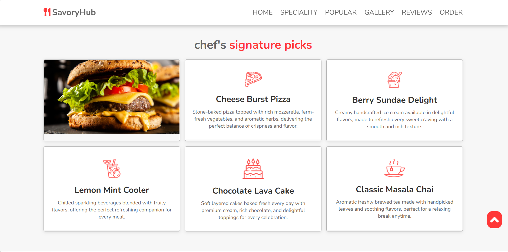
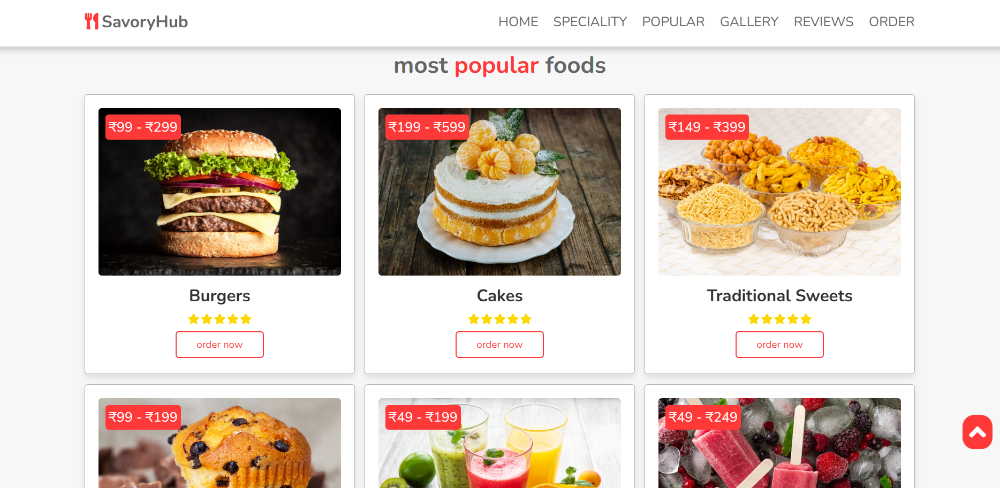
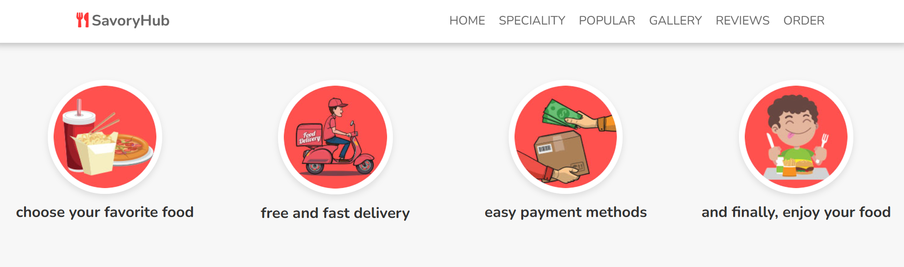
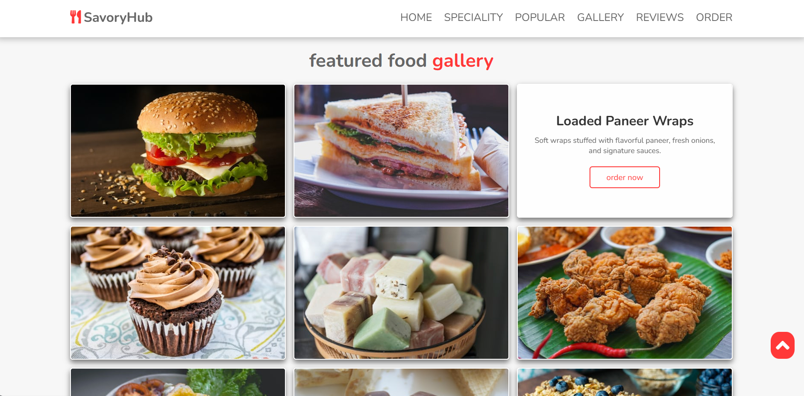
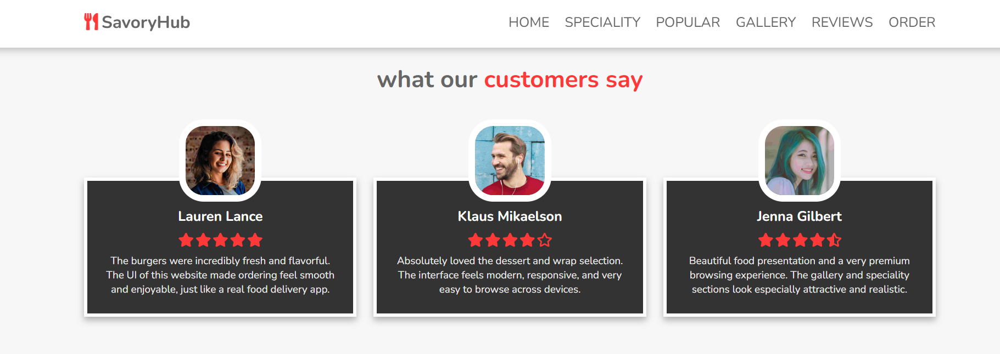
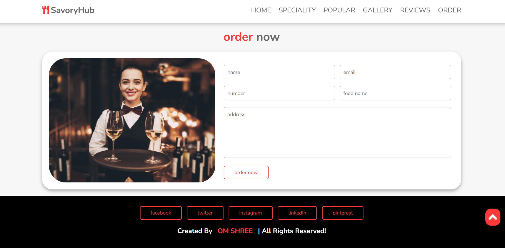

### 📱 Mobile Responsive Screens

| Screen 1                            | Screen 2                            | Screen 3                            |
| ----------------------------------- | ----------------------------------- | ----------------------------------- |
| 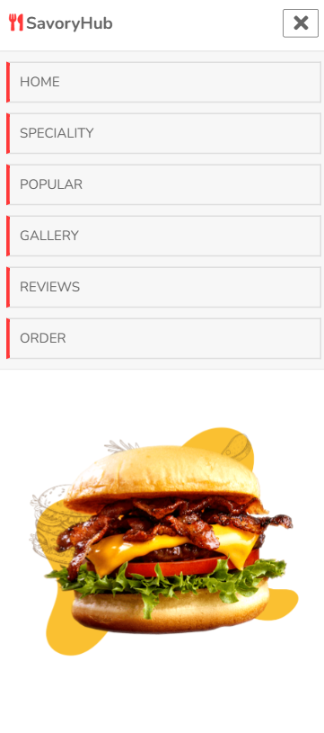 | 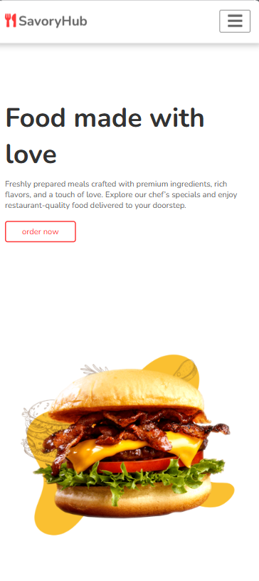 | 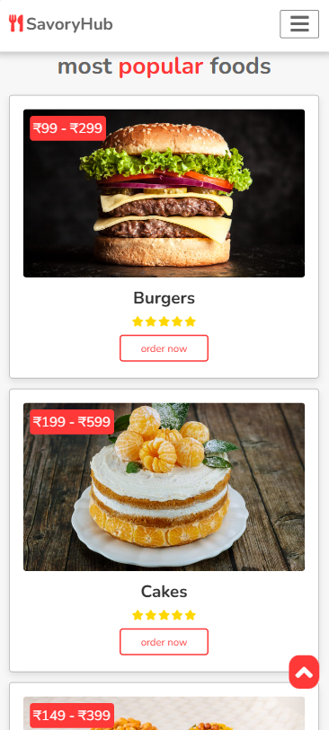 |

| Screen 4                            | Screen 5                            | Screen 6                            |
| ----------------------------------- | ----------------------------------- | ----------------------------------- |
| 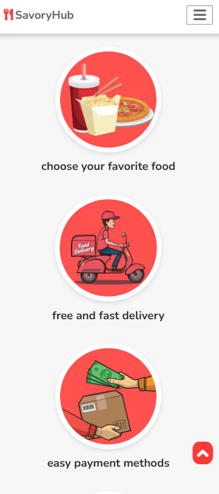 | 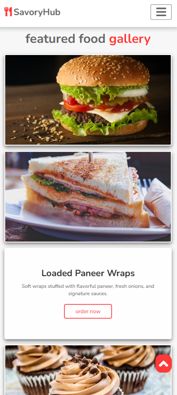 | 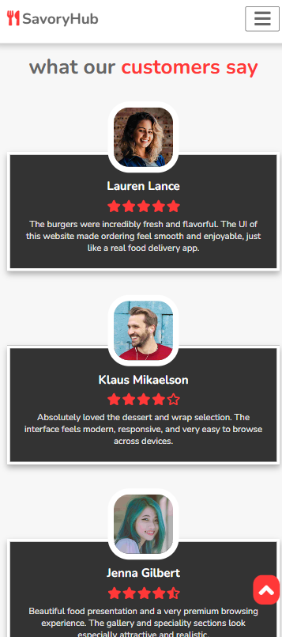 |

| Screen 7                            |   |   |
| ----------------------------------- | - | - |
| 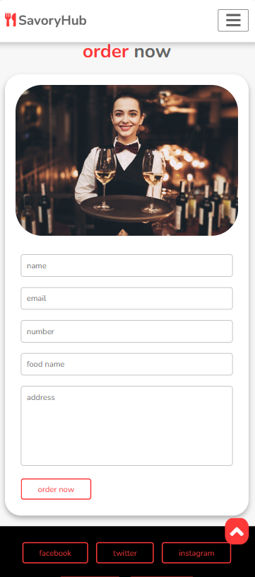 |   |   |

---

## 📚 Learning Journey

This project was originally built while learning **modern frontend website development** and responsive UI structuring.

The initial UI design was **inspired by a YouTube tutorial**, while the implementation, responsiveness handling, file organization, and GitHub portfolio documentation were customized and maintained independently.

This repository is now part of my **public developer portfolio**, showcasing my frontend fundamentals and UI building skills.

---

## 🚀 Run Locally

Since this is a pure frontend project, simply open:

```bash
index.html
```

Or use **Live Server** in VS Code for the best preview experience.

---

## 📁 Folder Structure

```text
food-ordering-frontend/
│── demo/
│── images/
│── index.html
│── index.css
│── script.js
│── README.md
│── .gitignore
```

---

## 💡 Future Enhancements

* 🛒 Add cart and quantity management
* 🔍 Dish search and category filters
* 🌙 Dark mode support
* 💳 Checkout UI flow
* ❤️ Wishlist / favorites system
* 🔗 Backend integration for real food ordering

---

## 👨‍💻 Author

**Om Shree**

